# 2026-group-2
2026 COMSM0166 group 2

🚀 [Launch Game: Click here to play Jellydrift](https://uob-comsm0166.github.io/2026-group-2/)

# Video Demostration

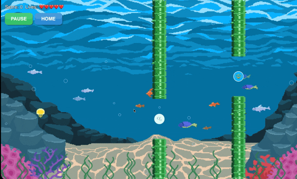

# Table of Content

# 1.Our Team

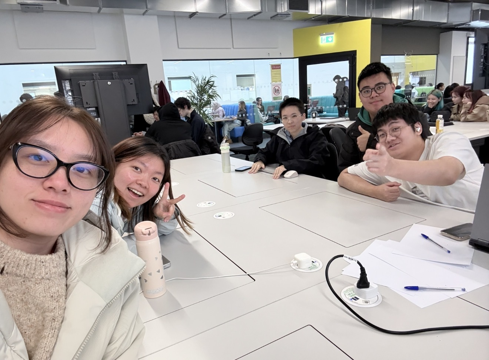

| Name | Email | Role |
|------|--------|------|
| Jingyang Xia | qh25729@bristol.ac.uk | UI Designer |
| Chuanxin Zhao | sa25704@bristol.ac.uk | Programmer |
| Haolan Hu | yn25057@bristol.ac.uk | Testing |
| Jintong He | uq25179@bristol.ac.uk | Coordinator |
| Yinghui Chen | en25553@bristol.ac.uk | Cross-Functional Collaborator |

# 2.Introduction

Our game is a casual arcade game inspired by Flappy Bird and Thunder Fighter. It combines the simple one-tap control of Flappy Bird with the variety of game modes and item-based gameplay often seen in Thunder Fighter. In the game, the player controls a jellyfish and must avoid obstacles while surviving as long as possible and achieving a higher score. The core design idea is to make the game easy to understand, quick to start, and enjoyable for a wide range of players.

The game includes four different modes: Normal Mode, Hard Mode, Gravity Reversal Mode, and Chaos Mode. Normal Mode provides the basic gameplay experience and serves as the foundation of the whole game. Hard Mode increases the challenge by making movement faster and harder to control. Gravity Reversal Mode changes the usual movement logic by making the jellyfish float upward naturally unless the player taps to move downward, creating a fresh and unfamiliar control experience. Chaos Mode combines different gravity rules and changing movement patterns, making it the most unpredictable and challenging mode.

The game also contains three items: a star, a harpoon, and a bubble. The star restores health, the harpoon gives a speed dash with temporary invincibility, and the bubble reduces gravity to make movement easier for a short time.

What makes our game novel is the combination of dynamic gravity changes, multiple gameplay modes, and strategic item appearances within a simple one-tap system. While the controls are easy to learn, the changing gravity and item timing add depth, challenge, and variety, giving players a more creative experience than a traditional Flappy Bird-style game.

# 3.Requirements 

## Ideation process

During the first week of group discussions, we finalized the game concept—to create a game that players can use to de-stress in their free time. Each person proposed one or two interesting game ideas. While deciding on the direction, we considered two main aspects. First, we wanted to learn about the key technologies of 2D games; second, we preferred to design a casual and stress-relieving gameplay mechanic. Based on the results of the first week's discussions, in the second week, our team, after brainstorming, ultimately selected the following two game concepts.
| Game Name | Introduce |
|----------|-----------|
| Flappy Bird | Flappy Bird uses "single-touch" controls as its core gameplay. Players simply need to tap the screen repeatedly to keep their character at a certain height and navigate through constantly appearing obstacle pipes. |
| Thunder Fighter | It's a vertical scrolling aerial combat shooting game. Players control a fighter jet, dodging enemy bullets, shooting down enemy planes, and collecting power-ups as the game progresses upwards. |

## Paper Prototypes

To gain a more detailed and in-depth understanding of the game mechanics and to compare whether the two games align with our game philosophy, we created two paper prototypes during the third workshop. Based on feedback from the paper models and students' feedback after playing the games, we further compared the two game concepts (see Table 1).

Flappy Bird：

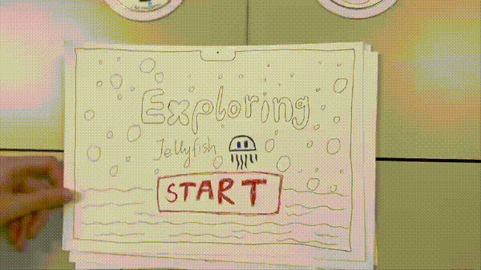

Thunder Fighter：

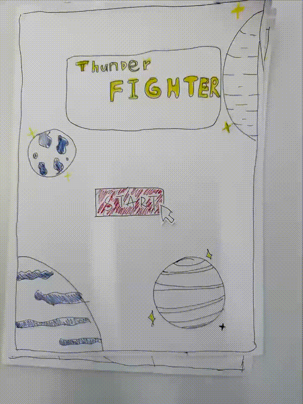

| Dimension | Flappy Bird | Thunder Fighter |
|-----------|-------------|-----------------|
| Learning Curve | Nearly zero | Easy to get started |
| Control Complexity | Very simple; single-touch control | More complex; continuous movement, dodging, and collecting power-ups |
| Visual Stimulation | Minimalist pixel style, simple screen content | High information density, with enemies, bullets, and power-ups |
| Content Depth | Shallow, single objective | Deeper content, requiring upgrades, equipment, and level progression |
| Sense of Pace | Very short rounds, light-paced, low failure cost | Longer pacing, high combat intensity |

In our discussion, we compared the two games in terms of difficulty and visual stimulation. We believe Flappy Bird is extremely simple to control, with almost no psychological burden; each game is short, making it suitable for short bursts of relaxation; and it has clear, minimalist goals, reducing cognitive load. However, it lacks depth, is too repetitive, and has limited content expansion. Thunder Fighter, on the other hand, has a strong sense of purpose and progression, offering rich variations, a strong sense of progression, and continuous updates; however, Thunder Fighter's visual and information intensity is high, requiring concentration and thus creating psychological pressure.

Therefore, we hope to develop a game based on Flappy Bird's core gameplay, where players control a character through obstacles by clicking. Building upon this, we will introduce level structures and an item system, allowing the game to maintain its simple controls and fast pace while adding gameplay variations and phased goals, thereby enhancing overall playability and sustained experience.

## stakeholders

The Onion Model helps us categorise stakeholders based on their proximity to the system.
Direct users interact with the game directly, while support roles enable its development and evaluation.
The containing system imposes technical and organisational constraints, and the wider environment reflects indirect but influential stakeholders.

## Use Case

The use case diagram for Jelly Drift provides a high-level representation of the system’s functional requirements by showing how the Player interacts with the game. The main actor in the diagram is the player, who initiates and controls most of the core game activities.

The diagram shows that the player can Start Game and Play Game as the two primary interactions. The Start Game use case includes Select Game Mode and Check High Score / Hall of Fame, suggesting that these are necessary or closely related actions before entering the game. During Play Game, the player may perform or experience several extended actions, including Move Jellyfish, Use Item, Lose Game, and opening the In-Game Menu. This indicates that gameplay is the central use case, with other actions occurring as optional or condition-based extensions. In addition, the In-Game Menu includes Quit Game and Restart Game, which allow the player to manage the current game session.

## User stories

| Stakeholder | Epic | User Story | Acceptance Criteria |
|-------------|------|------------|---------------------|
| Casual Players | Smooth and engaging gameplay experience | As a casual player, I want responsive single-tap controls so that the character reacts immediately and the gameplay feels satisfying. | Given that the game is running, when I tap the screen, then the character should instantly move upward with a consistent response time. |
| Casual Players | Motivating scoring system | As a casual player, I want to see my score increase when I pass obstacles so that I feel motivated to keep playing and improve my performance. | Given that the character passes an obstacle, when the obstacle is cleared, then the score should increase by one and be displayed on the screen. |
| New Players | Intuitive onboarding experience | As a new player, I want to quickly understand how the game works so that I can start playing without confusion. | Given that I open the game for the first time, when the game loads, then simple instructions such as **"Tap to Fly"** should be displayed. |
| New Players | Clear and simple game interface | As a new player, I want a simple and clear interface so that I can easily understand gameplay elements and controls. | Given that the game interface is displayed, when I view the main screen, then the character, obstacles, and score indicator should be clearly visible. |
| Developers | Maintainable game architecture | As a developer, I want the game logic to be modular and well-structured so that the system is easier to maintain and extend. | Given that the codebase is structured into modules, when new features are added, then changes can be made without affecting unrelated components. |
| Testers | Clear and testable gameplay behaviour | As a tester, I want clear gameplay rules so that I can verify whether the system behaves as expected during testing. | Given that the character collides with an obstacle, when the collision is detected, then the game should trigger the **Game Over** state immediately. |
| Competitor Game Developers | Competitive differentiation in gameplay design | As a competitor game developer, I want to analyse the gameplay mechanics of this game so that I can understand how it attracts players and improve my own game design. | Given that I observe the gameplay mechanics, when I compare the control system and obstacle design with similar games, then I should be able to identify the unique gameplay characteristics. |

# 4.Design

- 15% ~750 words 
- System architecture. Class diagrams, behavioural diagrams.

## System Architecture

Our game is built around several main components:

<ul>
  <li><strong>GameEngine:</strong> Manages the main game loop, player input, collision handling, score system, game state changes, level progression, and item effects.</li>
   
  <li><strong>Jellyfish:</strong> Controls the player character’s movement, position, and rendering.</li>
   
  <li><strong>Pipe:</strong> Handles obstacle generation, movement, rendering, and collision checking.</li>
   
  <li><strong>Item:</strong> Manages collectible objects and their gameplay effects.</li>
   
  <li><strong>Bubble and Seaweed:</strong> Support the underwater environment design and improve visual presentation.</li>
   
  <li><strong>AchievementManager:</strong> Tracks, unlocks, displays, and saves achievements during gameplay.</li>
</ul>

## class diagrams

As can be seen from the initial class diagram, our game adopts a centralized control structure centered around the Game Controller. This controller is responsible for managing game state, score, health, collision detection, item effects, and interactions between main game objects. The class diagram already includes core modules such as the player character Jellyfish, obstacles Pipe, items, and the achievement manager, indicating that the basic gameplay and functional framework of the game has been initially formed. However, this version of the class diagram also reveals some issues, such as the main controller's responsibilities being too centralized, different game modes not yet being independently modeled, and item functionality being relatively simple. These issues provide a clear direction for subsequent class diagram optimization and system refactoring.

- 

Compared with the initial class diagram, the final version shows that our game has developed from a simple playable prototype into a more complete game system. The final design introduces richer game states, player statistics, environmental elements, and a more complete achievement system. New classes such as Seaweed and Bubble improve both the visual presentation and the thematic consistency of the game. In addition, the final class diagram better reflects our core design ideas, especially gravity changes, level progression, and item-based interactions.

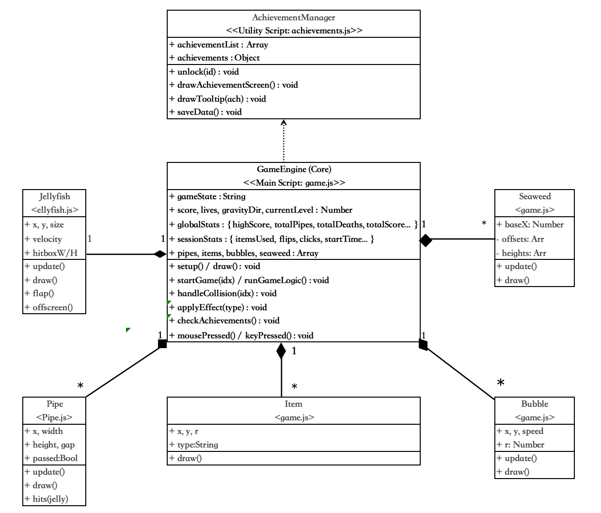

# 5.Implementation

- 15% ~750 words

- Describe implementation of your game, in particular highlighting the TWO areas of *technical challenge* in developing your game.

To develop our game, we focused on creating a system that was easy to understand and simple to control, while still offering enough variation to keep players engaged. During the design and implementation process, we identified two main technical challenges that were central to the gameplay experience. The first challenge was gravity adjustment. Since our game includes multiple modes, we needed to implement different movement rules for each one. In Normal Mode, the character follows a standard gravity setting. In Hard Mode, the gravity is stronger, making movement more difficult to control. In Gravity Reversal Mode, the usual gravity mechanic is replaced by buoyancy, so the character naturally floats upward instead of falling downward. This required us to carefully balance movement logic and player control. 

The second challenge was the item system. We designed three different items: one that restores life, one that temporarily changes gravity to make movement easier, and one that provides a short invincible dash. These items needed to appear at suitable moments and work smoothly with the different game modes. In the following section, we explain how these two technical challenges were implemented and how they shaped the final gameplay experience.

## Gravity-Based Gameplay Innovation

Our game introduces an innovative gravity-based gameplay mechanic, extending the traditional single-gravity system into multiple physics modes, including standard gravity and a buoyancy-like reverse gravity.
Instead of keeping the character's movement fixed throughout the game, we designed a level configuration system in which each mode is defined by different physical parameters, such as gravity and lift. This allows the game to create clearly different interactive experiences across modes.
In particular, the reverse gravity mode applies negative gravity values and an opposite lift direction, creating a buoyancy effect that changes the way players control the character.
From a technical perspective, this feature is implemented through parameterised level design and dynamic updates to the gravity direction at runtime.

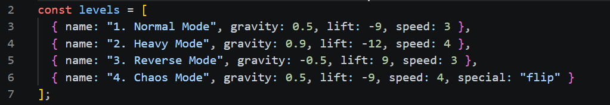
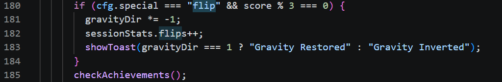

## Item System Innovation

Another key innovation in our game is the introduction of a three-item system, designed to enrich gameplay variety beyond the basic obstacle-avoidance mechanic.
Unlike manually activated abilities, these items are randomly distributed between obstacles during gameplay. Once the player-controlled character touches an item, its effect is triggered immediately. This design makes item collection a dynamic part of the movement and avoidance process, requiring players to react in real time while navigating through the level.
The three items provide different gameplay effects. The shield item increases the player’s life value, improving survivability after collisions. The dash item temporarily boosts movement speed, removes the effect of gravity, and creates a short invincible state, allowing the character to pass through obstacles safely for a limited time. The feather item reduces the influence of gravity and lift, creating a floating effect that makes character movement smoother and easier to control.
From a design perspective, this item system increases unpredictability and moment-to-moment variation in gameplay, as players may encounter different item effects at different positions in each run. From a technical perspective, the feature is implemented through a centralised effect-handling function and timer-based status updates, allowing item effects to be triggered instantly on contact and maintained for a controlled duration during runtime.

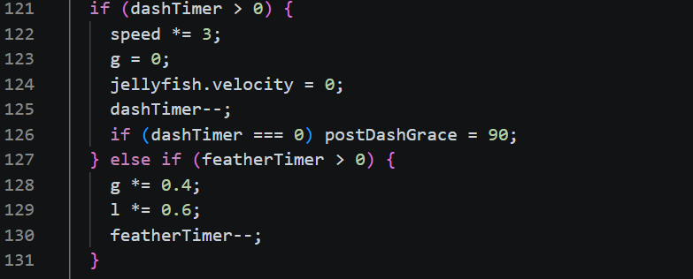
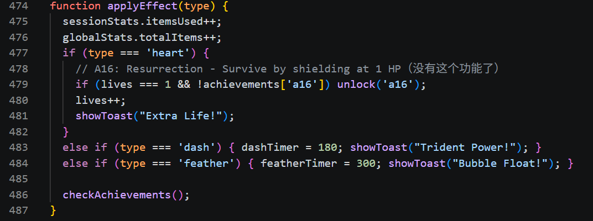

## Achievement Hall Innovation

Our third innovation is the introduction of an Achievement Hall system, which extends the game beyond simple survival and scoring by adding a collection-based progression mechanic. Instead of rewarding players only for high scores, the system recognises a wide range of play behaviours, such as passing obstacles, using items, surviving for long periods, completing mode-specific challenges, and reaching unusual gameplay conditions. This encourages players to explore different strategies and repeatedly engage with the game in order to unlock more achievements. From a design perspective, the Achievement Hall increases replayability, provides long-term goals, and gives players a clearer sense of progress. From a technical perspective, the feature is implemented through a structured achievement list and a centralised checking function, which continuously evaluates gameplay statistics and session data during runtime. This allows achievements to be unlocked automatically when specific conditions are met, creating a reward system that is both scalable and closely integrated with the core gameplay loop.

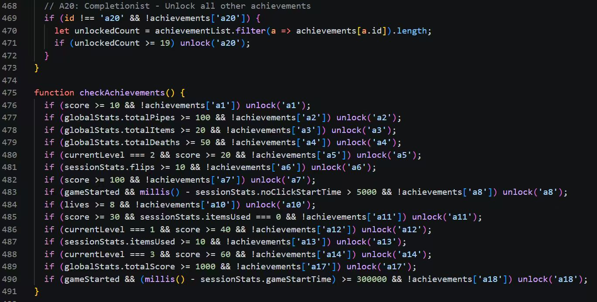
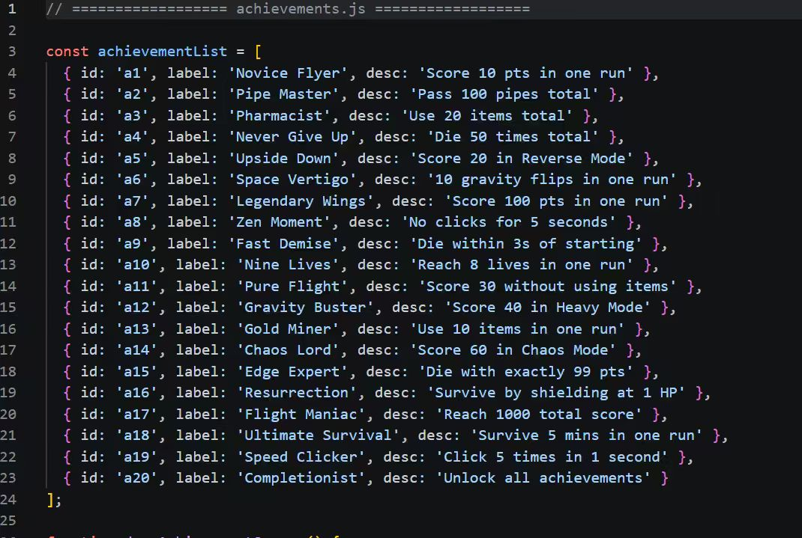

# 6.Evaluation

## Qualitative Evaluation

**(1) Think aloud**

Good experience

 - The single-tap control is very intuitive, allowing players to quickly understand how to play.
 - The flying and falling animations of the character are smooth and natural.
 - Obstacles are tightly spaced and challenging, encouraging players to keep trying.

Needs improvement

 - Some players reported that the timing of taps is difficult to master and requires multiple attempts to get used to.
 - When the game ends, there is no clear notification or feedback, making it difficult for players to understand why they failed.
 - Some players felt that the distance between obstacles in the same column is too small, making the game overly difficult.

Suggested improvements:

 - Increase the vertical spacing between initial obstacles to make it easier for players to get started.

 - Provide clear descriptions or instructions for all tools and items so that players can better understand their functions.

**(2) Heuristic Evaluation**

### Heuristic Evaluation Results

| Interface | Issue | Heuristic | Frequency | Impact | Persistence | Severity |
|-----------|------|-----------|-----------|--------|-------------|----------|
| Game Rules | The start screen lacks a clear game introduction. | Help and documentation | 3 | 2 | 1 | 2 |
| Game Rules | There is no reward system or achievement system. | Recognition rather than recall | 3 | 2 | 2 | 2.33 |
| Obstacle Design | Obstacles have excessive random height differences, making the game difficult. | Error prevention | 2 | 3 | 2 | 2.33 |
| Obstacle Design | The gap between obstacles is too narrow, making the game too difficult. | Error prevention | 3 | 3 | 2 | 2.67 |
| Game UI | The player is too far from obstacles at the start, leading to long waiting time. | Aesthetic and minimalist design | 3 | 1 | 3 | 2.33 |
| Game UI | The score is not reset automatically after restarting the game. | Consistency and standards | 3 | 4 | 4 | 3.67 |
| Controls | The game cannot be paused or reverted to the previous step. | User control and freedom | 2 | 2 | 2 | 2 |
| Game Objects | Players cannot adapt to the gravity change after the potion item effect. | Visibility of system status | 1 | 3 | 1 | 1.67 |
| Game Objects | Players cannot adapt to the transition after the invincibility item effect. | Visibility of system status | 1 | 2 | 1 | 1.33 |

### NASA-TLX
|  | 1(Strongly disagree) | 2 | 3 | 4 | 5(Strongly agree) |
|--|----------------------|---|---|---|-------------------|
| Mantal Demand (When staring at the screen for a long time, one needs to concentrate) | 2 | 3 |  | 4 | 1 |
| Physical Demand (Feeling hand fatigue) |  | 6 | 4 |  |  |
| Temporal Demand (The pace is fast) |  | 5 | 4 |   | 1 |
| Performance Satisfaction (Do you think you played the game well?) |  | 6 |  | 4 |  |
| Effort (How much effort did it take to achieve such results?) |  | 3 | 2 |  | 5 |
| Frustration (Experiencing frustration) | 2 | 5 |  |  | 3 |

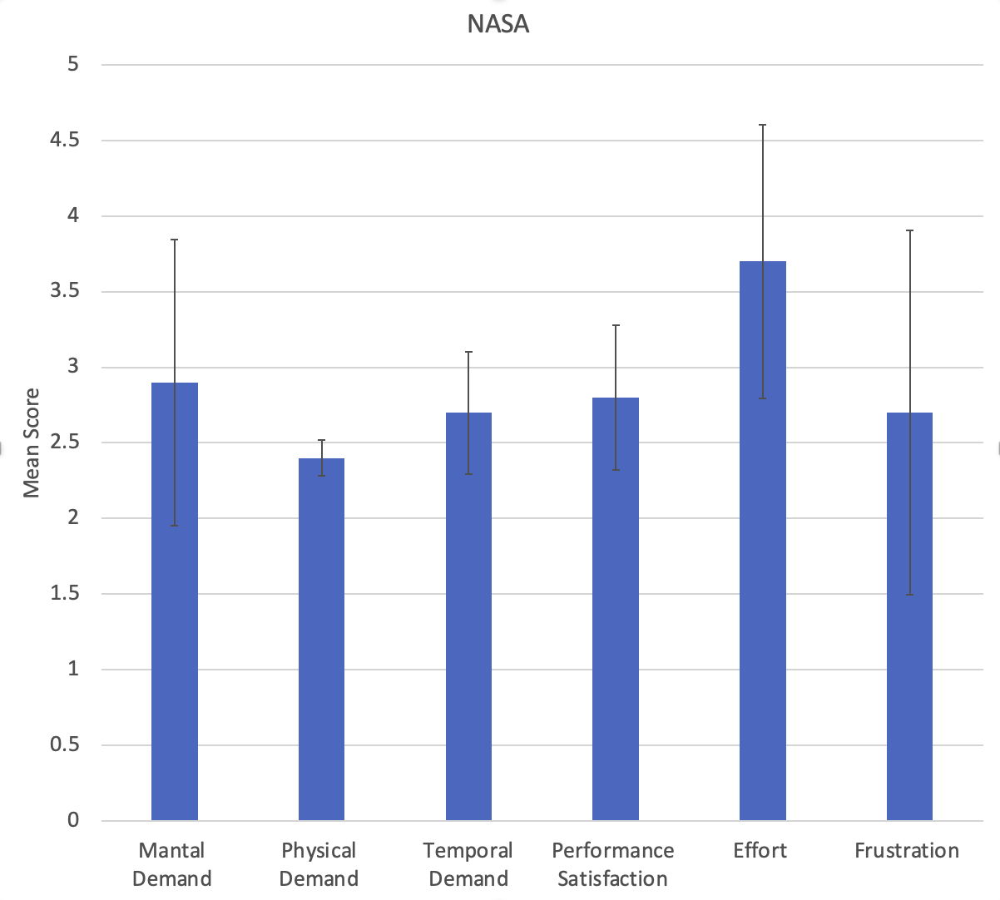

### SUS
|  | 1(Strongly disagree) | 2 | 3 | 4 | 5(Strongly agree) |
|--|----------------------|---|---|---|-------------------|
| I think that I would like to use this system frequently |  |  | 4 | 6 |  |
| I found the system unnecessarily complex |  | 7 | 3 |  |  |
| I think I would need the support of a technical person to be able to use this system |  | 3 |  | 3 | 4 |
| I found the various functions in this system were well integrated | 2 | 6 |  |  | 2 |
| I thought there was too much inconsistency in this system |  | 5 |  | 5 |  |
| I would imagine that most people would learn to use this system very quickly |  | 3 |  | 5 | 2 |
| I found the system very cumbersome to use | 3 | 6 |  |  | 1 |
| I felt very confident using the system |  |  | 2 | 8 |  |
| I needed to learn a lot of things before I could get going with this system | 1 | 3 | 4 |  | 2 |

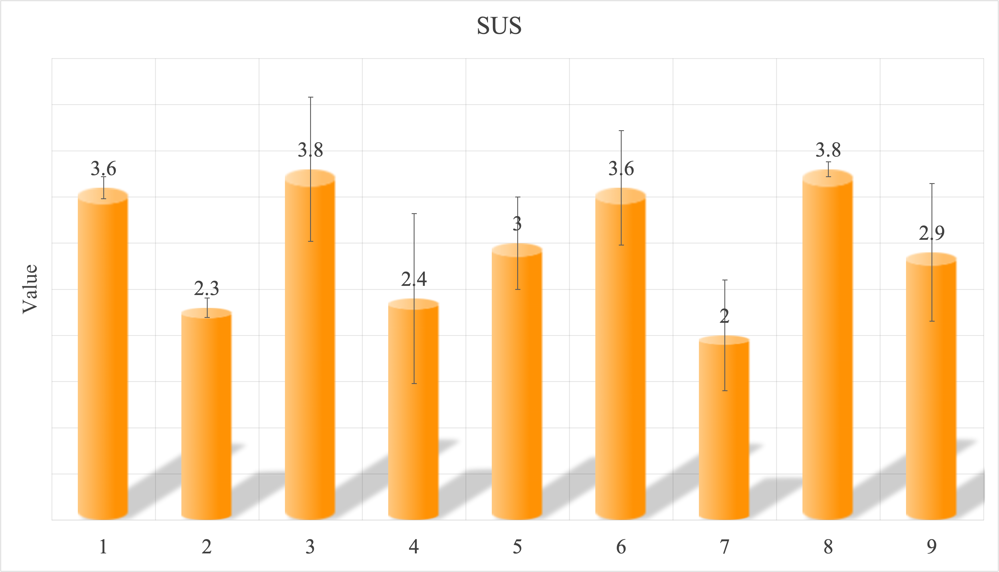

After summarizing all the feedback received from the qualitative assessment, we identified the following points as priorities:

- **Difficulty balancing is not well designed**
  - The height differences between obstacles are too random.
  - Some players found the tap timing difficult to master.
  - At the beginning of the game, there is a long waiting time before obstacles appear, but later the difficulty increases too quickly.

- **The game lacks clear feedback**
  - Players do not receive clear feedback when they lose.
  - Changes caused by item effects, such as gravity changes or the end of invincibility, are not clearly shown.

- **User control is limited**
  - The game cannot be paused.
  - Players cannot easily stop or adjust their actions during gameplay.

### BlackBox Test
<table>
  <tr>
    <th width="60"> Test ID </th>
    <th width="80"> Feature </th>
    <th width="80"> Precondition </th>
    <th width="80"> Step </th>
    <th width="240"> Expected </th>
    <th width="80"> Actual </th>
    <th width="80"> Note </th>
    <th width="40"> Vesion </th>
  </tr>
  <tr>
    <td colspan="8"><b>Launch & Entry</b></td>
  </tr>
  <tr>
    <td><b>BB-01</b></td>
    <td>Lauch</td>
    <td>Server running</td>
    <td>Open http://localhost:3000(run local hoster)</td>
    <td>Game screen loads (background, birds, music), no console errors</td>
    <td>Pass</td>
    <td> </td>
    <td>V1</td>
  </tr>
  <tr>
    <td><b>BB-02</b></td>
    <td>Lauch</td>
    <td>Server running</td>
    <td>Open http://localhost:3000(run local hoster)</td>
    <td>Game screen loads (background, birds, music), no console errors</td>
    <td> </td>
    <td>Pass</td>
    <td>V1</td>
  </tr>  
</table>

| Test ID | Feature | Precondition | Step | Expected | Actual | Note | Vesion |
|---------|---------|--------------|------|----------|--------|------|--------|
|**Launch & Entry**||||||||
| BB-01 | Lauch | Server running | Open http://localhost:3000(run local hoster) | Game screen loads (background, birds, music), no console errors | Pass | | V1 |
| BB-02 | Reload behavior | game is running | refresh the page | game return to the initial state (score reset) | Fail | score does not reset | V1 |
| BB-02 | Reload behavior | game is running | refresh the page | game return to the initial state (score reset) | Pass | score does not reset | V2 |
|**Mode/Restart**||||||||
| BB-03 | Normal mode on launch | page loaded | click normal mode | normal is shown with corret background, and jellyfish, and music | Pass |  | V1 |
| BB-04 | Return to main page | any mode is loaded | click "home" | return to main page, game screen loads | Fail | function not availble | V1 |
| BB-04 | Return to main page | any mode is loaded | click "home" | return to main page, game screen loads | Pass | function not availble | V2 |
| BB-05 | Normal mode play | Normal mode loaded | click to start | correct gravity assigned, wall generated, wall correctly moving towards jellyfish; background music | Pass |  | V1 |
| BB-06 | Game Over | remain chance equal to 0 | Trigger Game Over | Game restarts; score resets | Pass |  | V1 |
|**Input Controls**||||||||
| BB-07 | Mouse click flap | game running in active play state | click inside the game canvas once | jellyfish flaps upward immediately | Pass |  | V1 |
| BB-08 | Space key flap | game running in active play state | press space onece | jellyfish flaps upward immediately | Fail | no function | V1 |
| BB-09 | Rapid click | game running in active play state | click rapidly 10+ times | No freeze/crash; jellyfish movement remain consistent; game continues to respond | Pass |  | V1 |
| BB-10 | Input ignored | game running in active play state | do nothing | Jellyfish falls | Pass |  | V1 |
|**Scoring**||||||||
| BB-11 | Score increase after pissing a pipe | score is visible and known | pass one pipe successfully | Score increases by exactly +1 | Fail | score not very visiable | V1 |
| BB-11 | Score increase after pissing a pipe | score is visible and known | pass one pipe successfully | Score increases by exactly +1 | Pass |  | V2 |
| BB-12 | Score unchange after not pissing a pipe | score is visible and known | not pass pipe | Score unchange; life decrease by exactly -1 | Fail | score not very visiable | V1 |
| BB-12 | Score unchange after not pissing a pipe | score is visible and known | not pass pipe | Score unchange; life decrease by exactly -1 | Pass |  | V2 |
| BB-13 | Game Over |  | remain life is 0 | shown Game Over on canvas; shown score in this round | Pass |  ||  
|**Coliision & GameOver**||||||||
| BB-14 | Collision with upper pipe | In active play | fly into the upper pipe section | life decrease by -1; jellyfish flash indicating hit pipe or boundary and pipe stop moving; jellyfish move back to starting position and pipe restart moving (wait 3-5 seconds) | Fail | No points were deducted when hitting the top of the pillar | V1 |
| BB-14 | Collision with upper pipe | In active play | fly into the upper pipe section | life decrease by -1; jellyfish flash indicating hit pipe or boundary and pipe stop moving; jellyfish move back to starting position and pipe restart moving (wait 3-5 seconds) | Pass |  | V2 |
| BB-15 | Collision with lower pipe | In active play | fly into the lower pipe section | life decrease by -1; jellyfish flash indicating hit pipe or boundary and pipe stop moving; jellyfish move back to starting position and pipe restart moving (wait 3-5 seconds) | Fail | Points will be deducted when the bottom of the vehicle does not hit the pillar | V1 |
| BB-15 | Collision with lower pipe | In active play | fly into the lower pipe section | life decrease by -1; jellyfish flash indicating hit pipe or boundary and pipe stop moving; jellyfish move back to starting position and pipe restart moving (wait 3-5 seconds) | Pass |  | V2 |
| BB-16(a) | Collision boundary(up) | In active play | fly into the boundary | life decrease by -1; jellyfish flash indicating hit pipe or boundary and pipe stop moving; jellyfish move back to starting position and pipe restart moving(wait 3-5 seconds) | Pass |  | V1 |
| BB-16(b) | Collision boundary(down) | In active play | fly into the boundary | life decrease by -1; jellyfish flash indicating hit pipe or boundary and pipe stop moving; jellyfish move back to starting position and pipe restart moving(wait 3-5 seconds) | Fail | hit the pole but didn't lose any points | V1 |
| BB-16(b) | Collision boundary(down) | In active play | fly into the boundary | life decrease by -1; jellyfish flash indicating hit pipe or boundary and pipe stop moving; jellyfish move back to starting position and pipe restart moving(wait 3-5 seconds) | Pass |  | V2 |
| BB-17 | Game Over Freezes Game Play | Game over triggered | Game over triggered | Shonw "Game Over" on canvas, shown score on canvas, return to main page after click | Fail | game over without screen notice | V1 |
| BB-17 | Game Over Freezes Game Play | Game over triggered | Game over triggered | Shonw "Game Over" on canvas, shown score on canvas, return to main page after click | Pass |  | V2 |
|**Reset/Restart**||||||||
| BB-18 | Restart after game over | game open correctly | remain life is 0 | shown Game Over on canvas; shown score in this round | Fail | game over without screen notice | V1 | 
| BB-18 | Restart after game over | game open correctly | remain life is 0 | shown Game Over on canvas; shown score in this round | Pass |  | V2 | 
| BB-19 | Restart in active play| game open correctly | remain life is 0 | shown Game Over on canvas; shown score in this round | Fail | no this function | V1 |
| BB-19 | Restart in active play| game open correctly | remain life is 0 | shown Game Over on canvas; shown score in this round | Pass |  | V2 |

### WhiteBox Test
| Test ID | Feature | Precondition | Step | Expected | Actual | Note | Version |
|---------|---------|--------------|------|----------|--------|------|---------|
|**runGameLogic**||||||||
|WB-01| Game Started == false | game state is playing, game started is false, jellyfish object exist | call runGameLogic | the function should return early and only jellyfish exist | Pass | | V1 |
|WB-02| DashTimer > 0 | game state is playing, game started is true | call runGameLogic | DashTimer should decrease by 1, jellyfish velocity should reset | Pass | | V1 |
|WB-03| featherTimer > 0 | game started is true, game is in normal mode | call runGameLogic | featherTimer should decrease by 1, gravity should be reduce to 40% | Pass | | V1 | 
|WB-04| Offscreen jellyfish | game is playing, game started is true, game is in normal mode, Offscreen() == true | call runGameLogic | handleCollision(-1) should be triggerd, reducing lifes, recording death | Pass | | V1 |
|WB-05| Pass pipe is in chaos mode | score is 2, game state is playing, game started is true, current mode is chaos | call runGameLogic | the score should be increased, total pipe increase, sound play, gravity should be flipped when the score multiple of 3 | Pass | | V1 |
|WB-06| item pick up and removal | game state is playing, game started is true, one nearby dash item is vising collection dash | call runGameLogic | the item should be collected, remove from array, applyEffect() should active the dashTimer | Pass | | V1 |
|**applyEffect**||||||||
|WB-07| shield | player has one life remain, item counter start from 0 | call applyEffect('shield') | life counter increased by 1, item counter increase by 1, screen display "actual life", virable 16 unlock | Fail | screen not update | V1 |
|WB-07| shield | player has one life remain, item counter start from 0 | call applyEffect('shield') | life counter increased by 1, item counter increase by 1, screen display "actual life", virable 16 unlock | Pass |  | V2 |
|WB-08| dash | no other effects apply | call applyEffect('dash') | dashTimer should be changed 180, screen show dashTimer active | Fail | fail to diaplay dash active | V1 |
|WB-08| dash | no other effects apply | call applyEffect('dash') | dashTimer should be changed 180, screen show dashTimer active | Pass |  | V2 |
|WB-09| feather | no other effects active | call applyEffect('feather') | featherTime change to 300, life show lightaway | Pass | | V1 |
|**handleCollision**||||||||
|WB-10| live <= 0 | player is on the last life, the game is playing, the score is higher than the highest score | call handleCollision | the game should be end, high score should be updated, the game should return to the menu | Pass |  | V1|
|WB-11| live > 0 | player has more than one life, the pipe collision happen | call handleCollision | one life should be removed, the pipe should be removed, game play should continue | Pass |  | V1 |

### Process 

- 15% ~750 words

- Teamwork. How did you work together, what tools and methods did you use? Did you define team roles? Reflection on how you worked together. Be honest, we want to hear about what didn't work as well as what did work, and importantly how your team adapted throughout the project.

### Conclusion

- 10% ~500 words

- Reflect on the project as a whole. Lessons learnt. Reflect on challenges. Future work, describe both immediate next steps for your current game and also what you would potentially do if you had chance to develop a sequel.

### Contribution Statement

- Provide a table of everyone's contribution, which *may* be used to weight individual grades. We expect that the contribution will be split evenly across team-members in most cases. Please let us know as soon as possible if there are any issues with teamwork as soon as they are apparent and we will do our best to help your team work harmoniously together.

### Additional Marks

You can delete this section in your own repo, it's just here for information. in addition to the marks above, we will be marking you on the following two points:

- **Quality** of report writing, presentation, use of figures and visual material (5% of report grade) 
  - Please write in a clear concise manner suitable for an interested layperson. Write as if this repo was publicly available.
- **Documentation** of code (5% of report grade)
  - Organise your code so that it could easily be picked up by another team in the future and developed further.
  - Is your repo clearly organised? Is code well commented throughout?
