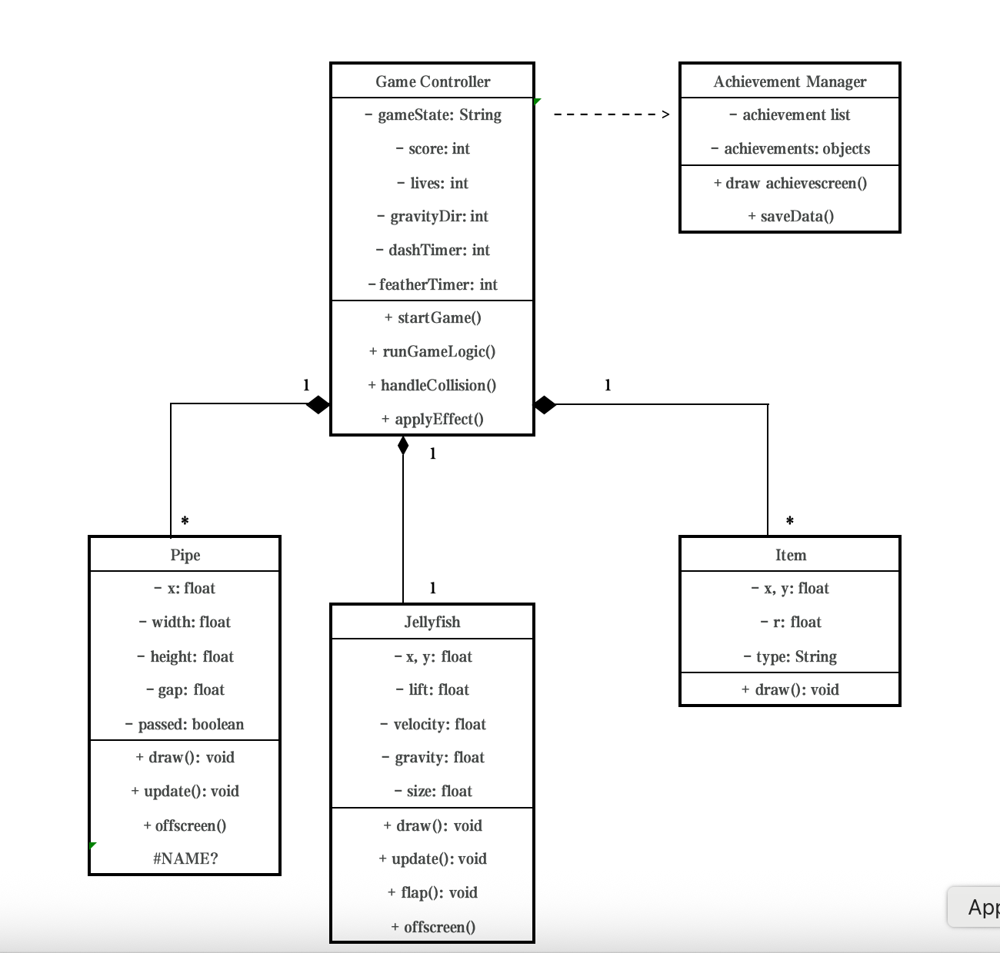

# 2026-group-2
2026 COMSM0166 group 2

🚀 [Launch Game: Click here to play Jellydrift](https://uob-comsm0166.github.io/2026-group-2/)

# COMSM0166 Project Template
A project template for the Software Engineering Discipline and Practice module (COMSM0166).

## Info

This is the template for your group project repo/report. We'll be setting up your repo and assigning you to it after the group forming activity. You can delete this info section, but please keep the rest of the repo structure intact.

You will be developing your game using [P5.js](https://p5js.org) a javascript library that provides you will all the tools you need to make your game. However, we won't be teaching you javascript, this is a chance for you and your team to learn a (friendly) new language and framework quickly, something you will almost certainly have to do with your summer project and in future. There is a lot of documentation online, you can start with:

- [P5.js tutorials](https://p5js.org/tutorials/) 
- [Coding Train P5.js](https://thecodingtrain.com/tracks/code-programming-with-p5-js) course - go here for enthusiastic video tutorials from Dan Shiffman (recommended!)

## Your Game (change to title of your game)

STRAPLINE. Add an exciting one sentence description of your game here.

IMAGE. Add an image of your game here, keep this updated with a snapshot of your latest development.

LINK. Add a link here to your deployed game, you can also make the image above link to your game if you wish. Your game lives in the [/docs](/docs) folder, and is published using Github pages. 

VIDEO. Include a demo video of your game here (you don't have to wait until the end, you can insert a work in progress video)

## Your Group

## Team Members

| Name | Email | Role |
|------|--------|------|
| Jingyang Xia | qh25729@bristol.ac.uk | UI Designer |
| Chuanxin Zhao | sa25704@bristol.ac.uk | Programmer |
| Haolan Hu | yn25057@bristol.ac.uk | Testing |
| Jintong He | uq25179@bristol.ac.uk | Coordinator |
| Yinghui Chen | en25553@bristol.ac.uk | Cross-Functional Collaborator |

## Project Report

### Introduction

- 5% ~250 words 
- Describe your game, what is based on, what makes it novel? (what's the "twist"?) 

### Requirements 

1.Ideation process

During the first week of group discussions, we finalized the game concept—to create a game that players can use to de-stress in their free time. Each person proposed one or two interesting game ideas. While deciding on the direction, we considered two main aspects. First, we wanted to learn about the key technologies of 2D games; second, we preferred to design a casual and stress-relieving gameplay mechanic. Based on the results of the first week's discussions, in the second week, our team, after brainstorming, ultimately selected the following two game concepts.
| Game Name | Introduce |
|----------|-----------|
| Flappy Bird | Flappy Bird uses "single-touch" controls as its core gameplay. Players simply need to tap the screen repeatedly to keep their character at a certain height and navigate through constantly appearing obstacle pipes. |
| Thunder Fighter | It's a vertical scrolling aerial combat shooting game. Players control a fighter jet, dodging enemy bullets, shooting down enemy planes, and collecting power-ups as the game progresses upwards. |

2.Paper Prototypes

To gain a more detailed and in-depth understanding of the game mechanics and to compare whether the two games align with our game philosophy, we created two paper prototypes during the third workshop. Based on feedback from the paper models and students' feedback after playing the games, we further compared the two game concepts (see Table 1).

Flappy Bird：
<video
  src="https://private-user-images.githubusercontent.com/255343089/546752418-23955137-b3f7-402d-aa8d-81cac59bd9d9.mp4?jwt=eyJ0eXAiOiJKV1QiLCJhbGciOiJIUzI1NiJ9.eyJpc3MiOiJnaXRodWIuY29tIiwiYXVkIjoicmF3LmdpdGh1YnVzZXJjb250ZW50LmNvbSIsImtleSI6ImtleTUiLCJleHAiOjE3NzA1NjM2MzksIm5iZiI6MTc3MDU2MzMzOSwicGF0aCI6Ii8yNTUzNDMwODkvNTQ2NzUyNDE4LTIzOTU1MTM3LWIzZjctNDAyZC1hYThkLTgxY2FjNTliZDlkOS5tcDQ_WC1BbXotQWxnb3JpdGhtPUFXUzQtSE1BQy1TSEEyNTYmWC1BbXotQ3JlZGVudGlhbD1BS0lBVkNPRFlMU0E1M1BRSzRaQSUyRjIwMjYwMjA4JTJGdXMtZWFzdC0xJTJGczMlMkZhd3M0X3JlcXVlc3QmWC1BbXotRGF0ZT0yMDI2MDIwOFQxNTA4NTlaJlgtQW16LUV4cGlyZXM9MzAwJlgtQW16LVNpZ25hdHVyZT03YmM3YjZjYzJmNGQ4YjRkODAyY2Q4NDM0NmIxMGE3YTgzNDk2MTg0NTE3MjlhZWUyYTNiYjA1N2ZkYmJkZjY0JlgtQW16LVNpZ25lZEhlYWRlcnM9aG9zdCJ9.SiFO9YgpYSM30EodSS3tWvqJzAYgIRUirMBQ4558eU4"
  controls
  width="400">
</video>

Thunder Fighter：
<video
  src="https://private-user-images.githubusercontent.com/255343089/546752403-0fb5d678-8608-49ac-8e71-79f6f376642a.mp4?jwt=eyJ0eXAiOiJKV1QiLCJhbGciOiJIUzI1NiJ9.eyJpc3MiOiJnaXRodWIuY29tIiwiYXVkIjoicmF3LmdpdGh1YnVzZXJjb250ZW50LmNvbSIsImtleSI6ImtleTUiLCJleHAiOjE3NzA1NjM2MzksIm5iZiI6MTc3MDU2MzMzOSwicGF0aCI6Ii8yNTUzNDMwODkvNTQ2NzUyNDAzLTBmYjVkNjc4LTg2MDgtNDlhYy04ZTcxLTc5ZjZmMzc2NjQyYS5tcDQ_WC1BbXotQWxnb3JpdGhtPUFXUzQtSE1BQy1TSEEyNTYmWC1BbXotQ3JlZGVudGlhbD1BS0lBVkNPRFlMU0E1M1BRSzRaQSUyRjIwMjYwMjA4JTJGdXMtZWFzdC0xJTJGczMlMkZhd3M0X3JlcXVlc3QmWC1BbXotRGF0ZT0yMDI2MDIwOFQxNTA4NTlaJlgtQW16LUV4cGlyZXM9MzAwJlgtQW16LVNpZ25hdHVyZT01ZTk2ODc4Yjk3MDgzNGJhYWUxZTdjNzk0YjQ1NjU2YTQyNjU0YWRkOWE4ZDRjMTQ4MTI0NGRlNzg2ZThhMWJjJlgtQW16LVNpZ25lZEhlYWRlcnM9aG9zdCJ9.7b8l-C0nx0_ldgtqHL_tjRbRcoDlqYK6KxdTC-Zv_cY"
  controls
  width="400">
</video>

| Dimension | Flappy Bird | Thunder Fighter |
|-----------|-------------|-----------------|
| Learning Curve | Nearly zero | Easy to get started |
| Control Complexity | Very simple; single-touch control | More complex; continuous movement, dodging, and collecting power-ups |
| Visual Stimulation | Minimalist pixel style, simple screen content | High information density, with enemies, bullets, and power-ups |
| Content Depth | Shallow, single objective | Deeper content, requiring upgrades, equipment, and level progression |
| Sense of Pace | Very short rounds, light-paced, low failure cost | Longer pacing, high combat intensity |

In our discussion, we compared the two games in terms of difficulty and visual stimulation. We believe Flappy Bird is extremely simple to control, with almost no psychological burden; each game is short, making it suitable for short bursts of relaxation; and it has clear, minimalist goals, reducing cognitive load. However, it lacks depth, is too repetitive, and has limited content expansion. Thunder Fighter, on the other hand, has a strong sense of purpose and progression, offering rich variations, a strong sense of progression, and continuous updates; however, Thunder Fighter's visual and information intensity is high, requiring concentration and thus creating psychological pressure.

Therefore, we hope to develop a game based on Flappy Bird's core gameplay, where players control a character through obstacles by clicking. Building upon this, we will introduce level structures and an item system, allowing the game to maintain its simple controls and fast pace while adding gameplay variations and phased goals, thereby enhancing overall playability and sustained experience.

3.stakeholders

The Onion Model helps us categorise stakeholders based on their proximity to the system.
Direct users interact with the game directly, while support roles enable its development and evaluation.
The containing system imposes technical and organisational constraints, and the wider environment reflects indirect but influential stakeholders.

4.Game content introduction

## Game Modes

| Mode | Description |
|---|---|
| **Normal Mode** | This is the standard game mode, designed to provide players with the core gameplay experience. Players click the left mouse button to make the jellyfish move upward briefly. The objective is to pass through obstacles safely while maintaining stable control and movement rhythm. This mode serves as the foundation for all other game modes. |
| **Hard Mode** | Hard Mode is a more advanced version of the standard gameplay. Compared with Normal Mode, the jellyfish is affected by a stronger gravity value, causing it to fall faster and making movement control more demanding. Players must react more quickly and perform more precise clicks in order to pass through obstacles successfully. This mode is designed to increase difficulty and test the player’s control skills. |
| **Gravity Reversal Mode** | Gravity Reversal Mode is based on the underwater setting of the game and introduces a different movement mechanic from Normal Mode. In this mode, the jellyfish naturally floats upward when no input is given, simulating buoyancy in water. By clicking the left mouse button, the player forces the jellyfish to move downward in order to pass through obstacles. This reversed control logic creates a new gameplay experience and requires players to adapt to a different movement pattern and rhythm. |
| **Chaos Mode** | Chaos Mode combines both the normal gravity-based mechanic and the buoyancy-based mechanic. During gameplay, the control rule changes dynamically according to random indicator signs. At certain moments, the jellyfish may be affected by normal downward gravity, while at other times it may switch to upward buoyancy. Players must pay close attention to the on-screen indicators and adjust their control strategy immediately. This mode increases unpredictability, tension, and overall challenge. |

## Props

|Props | Description | Availability |
|---|---|---|
| ⭐ **Star** | The Star is a health recovery item that increases the player’s remaining lives. Each jellyfish starts with **5 lives**, and every collision with an obstacle reduces **1 life** instead of ending the game immediately. Collecting a Star restores **1 life**, improving survivability and increasing the chance of achieving a higher score. | Available and effective in all four modes |
| **Harpoon** | The Harpoon is an item that provides both a **speed dash** and **temporary invincibility**. After activation, the jellyfish enters a rapid movement state, allowing it to pass through obstacle areas more quickly. During the dash, collisions do not reduce lives. A short extra invincibility period remains after the dash ends, giving players time to readjust their control smoothly. | Available and effective in all four modes |
| 🫧 **Bubble** | The Bubble is a **low-gravity item** that temporarily adjusts the gravity value acting on the jellyfish. By weakening gravity, the jellyfish’s movement becomes smoother and easier to control, giving players more time to react and adjust their position. | Available and effective in all four modes |

5.Use Case

The use case diagram for Jelly Drift provides a high-level representation of the system’s functional requirements by showing how the Player interacts with the game. The main actor in the diagram is the player, who initiates and controls most of the core game activities.

The diagram shows that the player can Start Game and Play Game as the two primary interactions. The Start Game use case includes Select Game Mode and Check High Score / Hall of Fame, suggesting that these are necessary or closely related actions before entering the game. During Play Game, the player may perform or experience several extended actions, including Move Jellyfish, Use Item, Lose Game, and opening the In-Game Menu. This indicates that gameplay is the central use case, with other actions occurring as optional or condition-based extensions. In addition, the In-Game Menu includes Quit Game and Restart Game, which allow the player to manage the current game session.

6.User stories

| Stakeholder | Epic | User Story | Acceptance Criteria |
|-------------|------|------------|---------------------|
| Casual Players | Smooth and engaging gameplay experience | As a casual player, I want responsive single-tap controls so that the character reacts immediately and the gameplay feels satisfying. | Given that the game is running, when I tap the screen, then the character should instantly move upward with a consistent response time. |
| Casual Players | Motivating scoring system | As a casual player, I want to see my score increase when I pass obstacles so that I feel motivated to keep playing and improve my performance. | Given that the character passes an obstacle, when the obstacle is cleared, then the score should increase by one and be displayed on the screen. |
| New Players | Intuitive onboarding experience | As a new player, I want to quickly understand how the game works so that I can start playing without confusion. | Given that I open the game for the first time, when the game loads, then simple instructions such as **"Tap to Fly"** should be displayed. |
| New Players | Clear and simple game interface | As a new player, I want a simple and clear interface so that I can easily understand gameplay elements and controls. | Given that the game interface is displayed, when I view the main screen, then the character, obstacles, and score indicator should be clearly visible. |
| Developers | Maintainable game architecture | As a developer, I want the game logic to be modular and well-structured so that the system is easier to maintain and extend. | Given that the codebase is structured into modules, when new features are added, then changes can be made without affecting unrelated components. |
| Testers | Clear and testable gameplay behaviour | As a tester, I want clear gameplay rules so that I can verify whether the system behaves as expected during testing. | Given that the character collides with an obstacle, when the collision is detected, then the game should trigger the **Game Over** state immediately. |
| Competitor Game Developers | Competitive differentiation in gameplay design | As a competitor game developer, I want to analyse the gameplay mechanics of this game so that I can understand how it attracts players and improve my own game design. | Given that I observe the gameplay mechanics, when I compare the control system and obstacle design with similar games, then I should be able to identify the unique gameplay characteristics. |
### Design

- 15% ~750 words 
- System architecture. Class diagrams, behavioural diagrams.

- 1.class diagrams

- As can be seen from the initial class diagram, our game adopts a centralized control structure centered around the Game Controller. This controller is responsible for managing game state, score, health, collision detection, item effects, and interactions between main game objects. The class diagram already includes core modules such as the player character Jellyfish, obstacles Pipe, items, and the achievement manager, indicating that the basic gameplay and functional framework of the game has been initially formed. However, this version of the class diagram also reveals some issues, such as the main controller's responsibilities being too centralized, different game modes not yet being independently modeled, and item functionality being relatively simple. These issues provide a clear direction for subsequent class diagram optimization and system refactoring.

- 

### Implementation

- 15% ~750 words

- Describe implementation of your game, in particular highlighting the TWO areas of *technical challenge* in developing your game. 

### Evaluation

1.Qualitative Evaluation

（1）Think Aloud(nasa)

Good experience

- The single-tap control is very intuitive, allowing players to quickly understand how to play.
- The flying and falling animations of the character are smooth and natural.
- Obstacles are tightly spaced and challenging, encouraging players to keep trying.

Needs improvement

- Some players reported that the timing of taps is difficult to master and requires multiple attempts to get used to.
- When the game ends, there is no clear notification or feedback, making it difficult for players to understand why they failed.
- Some players felt that the distance between obstacles in the same column is too small, making the game overly difficult.

Suggested improvements:

- Increase the vertical spacing between initial obstacles to make it easier for players to get started.

- Provide clear descriptions or instructions for all tools and items so that players can better understand their functions.

（2）Heuristic Evaluation

### Heuristic Evaluation Results

| Interface | Issue | Heuristic | Frequency | Impact | Persistence | Severity |
|-----------|------|-----------|-----------|--------|-------------|----------|
| Game Rules | The start screen lacks a clear game introduction. | Help and documentation | 3 | 2 | 1 | 2 |
| Game Rules | There is no reward system or achievement system. | Recognition rather than recall | 3 | 2 | 2 | 2.33 |
| Obstacle Design | Obstacles have excessive random height differences, making the game difficult. | Error prevention | 2 | 3 | 2 | 2.33 |
| Obstacle Design | The gap between obstacles is too narrow, making the game too difficult. | Error prevention | 3 | 3 | 2 | 2.67 |
| Game UI | The player is too far from obstacles at the start, leading to long waiting time. | Aesthetic and minimalist design | 3 | 1 | 3 | 2.33 |
| Game UI | The score is not reset automatically after restarting the game. | Consistency and standards | 3 | 4 | 4 | 3.67 |
| Controls | The game cannot be paused or reverted to the previous step. | User control and freedom | 2 | 2 | 2 | 2 |
| Game Objects | Players cannot adapt to the gravity change after the potion item effect. | Visibility of system status | 1 | 3 | 1 | 1.67 |
| Game Objects | Players cannot adapt to the transition after the invincibility item effect. | Visibility of system status | 1 | 2 | 1 | 1.33 |

After summarizing all the feedback received from the qualitative assessment, we identified the following points as priorities:

- **Difficulty balancing is not well designed**
  - The height differences between obstacles are too random.
  - Some players found the tap timing difficult to master.
  - At the beginning of the game, there is a long waiting time before obstacles appear, but later the difficulty increases too quickly.

- **The game lacks clear feedback**
  - Players do not receive clear feedback when they lose.
  - Changes caused by item effects, such as gravity changes or the end of invincibility, are not clearly shown.

- **User control is limited**
  - The game cannot be paused.
  - Players cannot easily stop or adjust their actions during gameplay.

### BlackBox Test
| Test ID | Feature | Precondition | Step | Expected | Actual | Note |
|---------|---------|--------------|------|----------|--------|------|
|**Launch & Entry**|||||||
| BB-01 | Lauch | Server running | Open http://localhost:3000 | Game screen loads (background, birds, music), no console errors | Pass | |
| BB-02 | Reload behavior | game is running | refresh the page | game return to the initial state (score reset) | Fail | score does not reset |
|**Mode/Restart**|||||||
| BB-03 | Normal mode on launch | page loaded | click normal mode | normal is shown with corret background, and jellyfish, and music |  |  |
| BB-04 | Return to main page | any mode is loaded |  | return to main page, game screen loads | Fail | function not availble |
| BB-05 | Normal mode play | Normal mode loaded | click to start | correct gravity assigned, wall generated, wall correctly moving towards jellyfish; background music |  |  |
| BB-06 | Game Over | | Trigger Game Over | Game restarts; score resets |  |  |
|**Input Controls**|||||||
| BB-07 | Mouse click flap | game running in active play state | click inside the game canvas once | jellyfish flaps upward immediately |  |  |
| BB-08 | Space key flap | game running in active play state | press space onece | jellyfish flaps upward immediately |  |  |
| BB-09 | Rapid | game running in active play state | clike rapidly 10+ times | No freeze/crash; jellyfish movement remain consistent; game continues to respond |  |  |
| BB-10 | Input ignored | game running in active play state | do nothing | Jellyfish falls |  |  |  
|**Scoring**|||||||
| BB-11 | Score increase after pissing a pipe | score is visible and known | pass one pipe successfully | Score increases by exactly +1 |  |  |  
| BB-12 | Score unchange after not pissing a pipe | score is visible and known | not pass pipe | Score unchange; life decrease by exactly -1 |  |  |  
| BB-13 | Game Over |  | remain life is 0 | shown Game Over on canvas; shown score in this round |  |  |  
|**Coliision & GameOver**|||||||
| BB-14 | Collision with upper pipe | In active play | fly into the upper pipe section | life decrease by -1; jellyfish flash indicating hit pipe or boundary and pipe stop moving; jellyfish move back to starting position and pipe restart moving (wait 3-5 seconds) |  |  | 
| BB-15 | Collision with lower pipe | In active play | fly into the lower pipe section | life decrease by -1; jellyfish flash indicating hit pipe or boundary and pipe stop moving; jellyfish move back to starting position and pipe restart moving (wait 3-5 seconds) |  |  | 
| BB-16 | Collision boundary | In active play | fly into the boundary | life decrease by -1; jellyfish flash indicating hit pipe or boundary and pipe stop moving; jellyfish move back to starting position and pipe restart moving(wait 3-5 seconds) |  |  | 
| BB-17 | Game Over Freezes Game Play | Game over triggered | Game over triggered | Shonw "Game Over" on canvas, shown score on canvas, return to main page after click |  |  | 
|**Reset/Restart**|||||||
| BB-18 | Restart after game over |  | remain life is 0 | shown Game Over on canvas; shown score in this round |  |  |  
| BB-19 | Restart in active play|  | remain life is 0 | shown Game Over on canvas; shown score in this round |  |  |  
| BB-20 | ||||||
| BB-21 | ||||||

### WhiteBox Test
| Test ID | Feature | Precondition | Step | Expected | Actual | Note |
|---------|---------|--------------|------|----------|--------|------|
|**runGameLogic**|||||||
|WB-01|||||||
|WB-02|||||||
|**applyEffect**|||||||
|WB-03| shield ||||||
|WB-04| dash ||||||
|WB-05| feather ||||||
|WB-06|||||||
|**handleCollision**|||||||
|WB-07| live <= 0 ||||||
|WB-08| live > 0 ||||||

### Process 

- 15% ~750 words

- Teamwork. How did you work together, what tools and methods did you use? Did you define team roles? Reflection on how you worked together. Be honest, we want to hear about what didn't work as well as what did work, and importantly how your team adapted throughout the project.

### Conclusion

- 10% ~500 words

- Reflect on the project as a whole. Lessons learnt. Reflect on challenges. Future work, describe both immediate next steps for your current game and also what you would potentially do if you had chance to develop a sequel.

### Contribution Statement

- Provide a table of everyone's contribution, which *may* be used to weight individual grades. We expect that the contribution will be split evenly across team-members in most cases. Please let us know as soon as possible if there are any issues with teamwork as soon as they are apparent and we will do our best to help your team work harmoniously together.

### Additional Marks

You can delete this section in your own repo, it's just here for information. in addition to the marks above, we will be marking you on the following two points:

- **Quality** of report writing, presentation, use of figures and visual material (5% of report grade) 
  - Please write in a clear concise manner suitable for an interested layperson. Write as if this repo was publicly available.
- **Documentation** of code (5% of report grade)
  - Organise your code so that it could easily be picked up by another team in the future and developed further.
  - Is your repo clearly organised? Is code well commented throughout?
